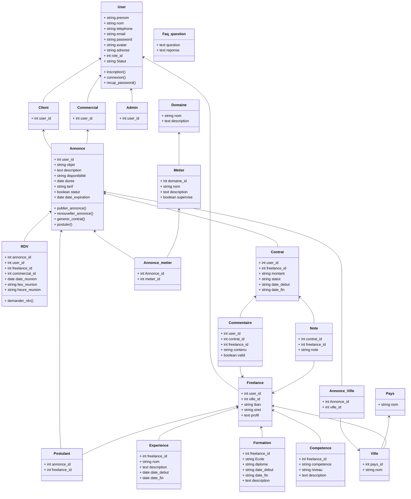

# Diagramme de classe

```mermaid
classDiagram

class User{
    + string prenom
    + string nom
    + string telephone
    + string email
    + string password
    + string avatar
    + string adresse
    + int role_id
    + string Statut
    + inscription()
    + connexion()
    + recup_password()
}

Client <-- Annonce
Commercial <-- Annonce
User <-- Freelance
User <-- Client
User <-- Admin
User <-- Commercial

class Faq_question{
  + text question    
  + text reponse    
}

class Annonce{
    + int user_id
    + string objet
    + text description
    + string disponibilité
    + date duree
    + string tarif
    + boolean statut
    + date date_expiration
    + publier_annonce()
    + renouveller_annonce()
    + generer_contrat()
    + postuler()
    
}
Annonce <-- RDV
Annonce <-- Contrat
Annonce <-- Postulant
Annonce <-- Annonce_metier
Metier <-- Annonce_metier
Annonce <-- Annonce_Ville

Annonce_Ville --> Ville

class Annonce_Ville {
    + int Annonce_id
    + int ville_id
}
class Annonce_metier {
    + int Annonce_id
    + int metier_id
}

class Ville{
    + int pays_id
    + string nom
}

Pays <-- Ville

class Pays{
    + string nom
}

class RDV{
    + int annonce_id
    + int user_id
    + int freelance_id
    + int commercial_id
    + date date_reunion
    + string lieu_reunion
    + string heure_reunion
    + demander_rdv()
}
class Commentaire{
    + int user_id
    + int contrat_id
    + int freelance_id
    + string contenu
    + boolean valid
}

Commentaire --> Freelance 

class Contrat{
    + int user_id
    + int freelance_id
    + string montant
    + string statut
    + string date_debut
    + string date_fin
}
Contrat <-- Note
Contrat <-- Commentaire

class Note{
    + int contrat_id
    + int freelance_id
    + string note
}
Note --> Freelance
class Postulant{
    + int annonce_id
    + int freelance_id
}
Freelance <--Postulant
class Admin{
    + int user_id
}

class Client{
    + int user_id
}

class Commercial{
    + int user_id
}

class Freelance {
    + int user_id
    + int ville_id
    + string iban
    + string siret
    + text profil
}

Freelance <-- Experience
Freelance <-- Formation
Freelance <-- Competence
Freelance <-- Ville

class Experience {
  + int freelance_id
  + string nom
  + text description 
  + date date_debut
  + date date_fin
}


class Competence {
  + int freelance_id
  + string competence
  + string niveau
  + text description 
}

class Formation {
  + int freelance_id
  + string Ecole
  + string diplome
  + string date_debut
  + string date_fin
  + text description 
}

class Domaine {
  + string nom
  + text description 
}
Domaine <-- Metier

class Metier {
  + int domaine_id
  + string nom
  + text description 
  + boolean supervise
}

```
