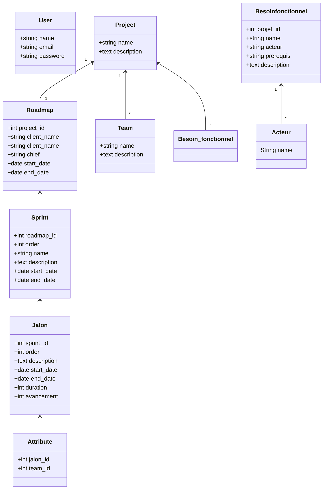

# Diagramme de classe

```mermaid
classDiagram

class User{
    +string name
    +string email
    +string password
}


class Project{
    +string name
    +text description
}

Project "1" <-- "1" Roadmap
Project "1" <-- "*" Team
Project "1" <-- "*" Besoin_fonctionnel


class Besoinfonctionnel{
    +int projet_id
    +string name
    +string acteur
    +string prerequis
    +text description
}

Besoinfonctionnel "1" <-- "*" Acteur

class Acteur{
    String name
}

class Roadmap{
    +int project_id
    +string client_name
    +string client_name
    +string chief
    +date start_date
    +date end_date
}
Roadmap <-- Sprint

class Sprint{
    +int roadmap_id
    +int order
    +string name
    +text description
    +date start_date
    +date end_date
}
Sprint <-- Jalon

class Jalon{
    +int sprint_id
    +int order
    +text description
    +date start_date
    +date end_date
    +int duration
    +int avancement
}
Jalon <-- Attribute

class Team{
    +string name
    +text description
}

class Attribute{
    +int jalon_id
    +int team_id
}


```
