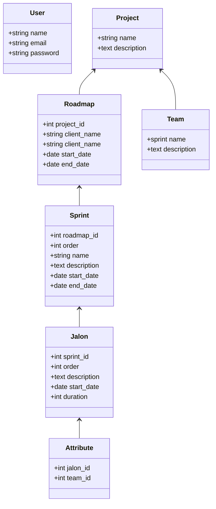

# Diagramme de classe

```mermaid
classDiagram

class User{
    +string name
    +string email
    +string password
}


class Project{
    +string name
    +text description
}
Project <-- Roadmap
Project <-- Team

class Roadmap{
    +int project_id
    +string client_name
    +string client_name
    +date start_date
    +date end_date
}
Roadmap <-- Sprint

class Sprint{
    +int roadmap_id
    +int order
    +string name
    +text description
    +date start_date
    +date end_date
}
Sprint <-- Jalon

class Jalon{
    +int sprint_id
    +int order
    +text description
    +date start_date
    +int duration
}
Jalon <-- Attribute

class Team{
    +sprint name
    +text description
}

class Attribute{
    +int jalon_id
    +int team_id
}


```
